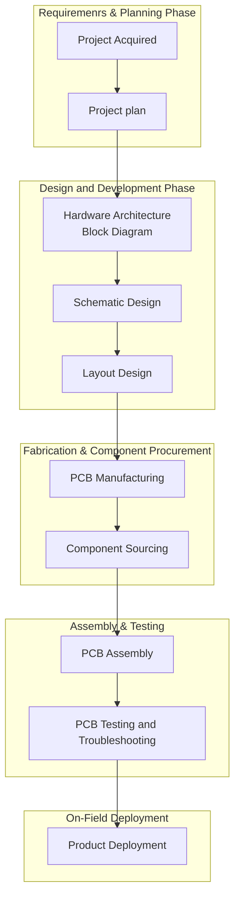
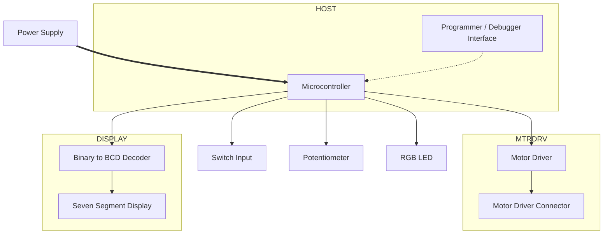

# ATMEGA328P Based Hardware Design

**Credits**
Instructor: Piyush Charpe
Course: Arduino compatible Electronics Circuit Design & Eagle PCB Design course using Atmega328p Microcontroller
Platform: Udemy

## Table of Contents

## Overview

## Module 01: Introduction to Electronics Components

### Introduction to Resistors
1. Resistor is a passive two terminal electrical component that implements electrical resistance as a circuit element.
2. It limits the amount of current flowing through the circuit or a branch of a circuit
3. Examples:
    1. To current limit an led, we can connect a resistor in series of x Ohms to limit the intensity of the led.
    2. It is used in voltage divider circuit, can this circuit can be used in opamp where we need to use the voltage divider circuit it provide reference voltage.
4. Resistors are available in both packages - through hole (tht) and surface mount (smd)

### Introduction to Poentiometer
1. A Potentiometer is a three-terminal resistor with a sliding or rotating contact that forms an adjustable voltage divider.
2. A Potentiometer os used as a variable resistor and can be used to set the desired voltage as per the requirement.
3. Its a three terminal device with terminal 1 and 3 (known as outer terminals) are used to connect with the circuit and a fixed value is measured and the 2nd terminal is called the "Wiper Contact" the moves along it.
4. Pinout:
    1. Pin 1 (Input/Ground): Connected to one end of the internal resistive track, and can be wired to ground or a reference voltage depending on the intended direction of adjustment.
    2. Pin 2 (Wiper Contact - Output): The Middle pin, this terminal touches the resistive strip and picks off the adjusted voltage, and this pin alsom connects to the microcontroller or device being controlled.
    3. Pin 3 (Input/Ground): Connected to the opposite end of the resistive track, if Pin 1 is connected to ground, Pin 3 receives the supply voltage (Vin).
5. Applications:
    1. Voltage Divider Circuit with variable output via potentiometer.
    2. Variable Resistor / Rheostat
6. Functional Diagram and Schematic Symbol:
    

### Introduction to Capacitor
1. A Capacitor is a passive two terminal electrical component that stores energy in the form of electric field.
2. Applications of a capacitor - Energy Storage, Filtering.
3. Capacitive reactance (Xc)
4. Resistor provides opposition to current, and capacitive reactance provides opposition to signal or current.
5. The Capacitve reactance of capacitor decided whether the signal will be bypassed or not.
6. In real world, the build of the capacitor consitutes some amount of resistor, inductor and then capacitor.
7. The resistor present in the capacitor is called the Equivalent Series Resistance [ESR] and exhibits the property of resistance.
8. The inductor present in the capacitor is called the Equivalent Series Inductance and exhibts the property of inductance reactance.
9. The Capacitance presents in the capacitor exhibits the property of Capacitive Reactance (Xc).
10. The Combined the effect of ESR, ESL and Xc contributes to the Impedance (Z) of the capacitor.
11. The Impedance of the Capacitor will decide if a signal will be bypassed or not. so if the impedance provided by the capacitor is low, then signal will be bypassed by the capacitor towards the ground. and if high, then signal will not be bypassed.
12. To find out at what frequencies does the capacitor provides what impedance? - The Impedance VS Frequency plot of the Capacitor in the datasheet or manufacturer website.
13. Xc = 1/wc , where w = 2*pi*f --> Xc = 1/2*pi*f*c
14. Types of Capacitors - Ceramic Capacitors, Tantalum Capacitors, Electrolytic Capacitor, Plastic film, and super capacitor.

---

## Module 2: Intro to Training Hardware & Development Process
Ideal/Primary Hardware Development Process:

### Hardware Development Process

#### Plan Phase
##### Project Acquired
Lets is consider two parties - Client and Design Company
1. The Client and Design Company would create and sign an NDA.
2. The Client will share a product requirement document to the Design Company - The Document would contain:
    1. Specifications of the product
    2. Features to incorporate
    3. Product Industry
    4. Quantity of Product
    5. Clients expectation
    6. Deliverty timespan
    7. Project Deliverables
3. The Design Company would then build a proposal for that particular product, which will target the product requirement documentation with inputs from the client.
4. This process will continue between both parties, until they agree on the proposal.

##### Project Plan
Project plan is a product development phase, in whcih the company discusses how to complete a project within a certain time frame considering different stages.
Plan:
1. Project Timeline Creation with mutal team discussion
2. Team roles assignment
3. E.g. An Ideal team:
    1. Hardware Designer
    2. Firmware Developer
    3. Application Developer
    4. mechanical Designer
    5. System Architect (Team lead)
    6. Project Manager

#### Design & Development Phase
This Phase is handled by the Hardware Design Engineer.

#### Hardware Architecture
The hardware block diagram is designed in this phase.

##### Schematic Design
Each block from the hardware block diagram is designed one by one in the schematics of the software.

##### Layout Design
The Layouting of the design blocks is done in this stage, and the PCB Layout and Routing are done by the Hardware Design Engineer.

The Mechanical Engineer would provide inputs and requirements to the hardware design engineer,m so that the pcb can be designed wrt the enclosure design.

#### Fabrication and Procurement Phase
##### PCB Manufacturing
The Hardware Design Engineer would then generate the manufacturing files i.e. Gerber files from the CAD software.
The Gerber files are then shared with the manufacturer to manufacture the PCB.

##### Component Sourcing
This stage is also processed parallely to the PCB Manufacturing phase, and the Bill of Materials (B.O.M) are generated by the CAD Software and Updated with the order quantity requirements.

#### Assembly and Testing Phase
##### PCB Assembly
The Manufactured PCB is received and the team would then solder all the components and get the design ready.
If the Design is complex to solder like BGA or other complex components, the design company may select the PCB-Assembly path, where the manufacturer assembles the PCB and handles the complex sodlering via automated machines and then the entire PCB is assembled or the PCBs are sent to an Electronics Manufacturing Service [EMS] company that would assembly and ready the PCB design and then shipped to the design company.

Note: Whenever the EMS is considered, the cost increases and needs to be taken into considerations by the product manager.

##### PCB Testing and Troubleshooting
The Hardware Design engineer will check all the Blocks in the Design for validating the design is working as intended.

Note: The Hardware may also be keep running for days/Weeks or a month for hardware valdiations.

#### Deployment Phase
##### Product Deployment
The Hardware is then assembled in the enclosure and the firmware is also deployed and tested rigorously and then deployed on field for testing and then released once all the objectives are cleared.

### Hardware Block Diagram Design

## Module 02: Hardware Design & Development

### Power Supply unit [PSU] Design

#### System power budget calculation
Power budget is the power utilization and power consumption calculation associated with the system.

**Power Supply Consumption Table**
| Component         | Voltage   | Current   | Power |
|:------------------|:----------|:----------|:------|
| ATMEGA328P        | 5V        | 300mA     | 1.5W  |
| MTR DRV VCC1      | 5V        | 60mA      | 0.3W  |
| MTR DRV VCC2      | 12V       | 100mA     | 1.2W  |
| BIN2BCD DECODER   | 5V        | 60mA      | 0.3W  |
| Switch Input      | 5V        | 1mA       | 0.005W|
| Potentiometer     | 5V        | 1mA       | 0.005W|
| RGB LED           |           |           |       |
| PSU (5V RAIL)     | 5V        | 422mA     | 2.11W |
| PSU IN (12V RAIL) | 12V       |           |       |

Note:
1. The LDO being used has an efficientcy of 50%.
2. Due to 50% efficientcy, to provide 2.11W at the 5V rail, we would need to provide double the Wattage at the power input side i.e. 2.11*2 = 4.22W. [Input Power: 4.22, Output Power: 2.11W]
3. To Calculate the Input Current needed, we would need to use `P=VI`, therefore `I=P/V` i.e. I=4.22/12 >> 0.351A it.e. 351mA.
4. 351mA is the current requirement for the input current to power the 5V rail, but we also need another 100mA at the output rail to power the Motor Driver section, therefore the total current conumption would br 351+100 = 451mA.
5. Therefore:
    1. `Input Voltage` >> 12V
    2. `Input Current` >> 451mA
    3. `Output voltage@Current` >> 351mA@5V & 12V@100mA.
    4. LDO Efficiency >> 50%

#### Power Supply Design
1. Power Supply IC - 7805 from ST
2. Power Supply Design Components:
    1. Power Input DC Jack with Revere Polarity Protection via schottky Diode.
    2. Input Filtering Capacitor Section
    3. LM708 IC Section
    4. Output Filtering Capacitor Section
    5. PWR Led Indication Section
3. Reverse Polarity Protection Design
    1. General Purpose Diode - Threshold Voltage: 0.7V, therefore for 1A of current -> P = VI, `P = 1(A) * 0.7 = 0.7W` of power dissipation.
    2. Schottky diode - Threshold voltage: 0.3, therefore for 1A of current -> P = VI, `P = 1(A) * 0.3 = 0.3W` of power dissipation.
    3. Therefore the schottky diode has less power consumption, which would then be the better choice in selection.
    4. Three critical parameters to consider when selecting a schottky diode to ensure efficiency, safety, and reliability are `Threshold Voltage`, `Current Rating`, and `Reverse Voltage Rating`.
        1. Threshold Voltage, which is commonly called the forward voltage drop (`Vf`) is the minimum voltage required accross the diode terminals to make it conduct current in the forward direction.
            1. For a standard Schottky diode, this typically ranges from 0.15V to 0.45V, which is significantly lower than the 0.7 V drop of a standard silicon diode.
            2. A lower Vf means lower power dissipation (P = I*Vf) and higher efficiency, maing it ideal for low-voltage or battery-powered applications.
            3. Note: Vf increases as the forward current and operating temperature increases.
        2. Current Rating, which is commonly specified as Average Forward Rectified Current (`If(av)`) is the maximum amount of current the diode can safely conduct continuously in the forward direction without overheating or failing.
            1. This parameter dictates how much load current the diode can handle under normal operating conditions.
            2. Selecting a diode with a current rating at least 20% to 50% higher than your circuit's peak continuous operating current to provide a safety margin.
            3. Also check the Peak Surge Current (`Ifsm`) if the circuit experiences brief, massive current spikes during startup.
        3. Reverse Voltage Rating, which is commonly specified as Peak Repetitve Reverse Voltage (`Vrrm`) is the maximum voltage the diode can withstand when it is reverse-biased (blocking current) before it breaks down.
            1. If the voltage in reverse exceeds this limit, the diode will enter avalanche breakdown, conduct heavily in reverse and likely destroy itself.
            2. Choose a diode where Vrmm is atlease 1.5 to 2 times higher than the maximum voltage expected in your circuit.
            3. This buffer protects the diode from inductive voltage spikes and ringing.
            4. Note: Schottky diode inherently have higher reverse leakage currents than standard silicon diodes, and this leakage increases drastically at high temperatures.
    5. Diode selected for the circuit: SS14
4. Input & Output Filtering Capacitor Section
    1. Local Capacitor - to fullfil the sudden current requirement by the circuit at startup.
    2. The Local Capacitors are connected at both the input and output section of the LM708 IC.
    3. Lower ESR will allow fast charging of the capacitor.
    4. A lower ESR capacitor like 0.1 uf at input and output to allow the capacitor to charge faster, but also filter high frequency noise on the DC Line.
    5. The Bypass Capacitor (0.1 uf) is integrated at input and output sections to filter out higher frequency and also lower the ESR for fast charging of the capacitors.
5.  PWR Led Indication Section